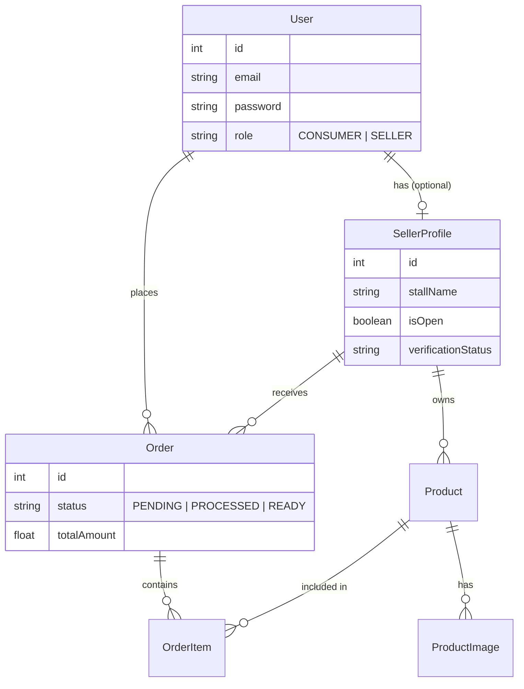

# Final Project Report: ITS Hungry Hub

**Framework Programming - 2025/2026**
**Department of Informatics - Institut Teknologi Sepuluh Nopember**

---

## 1. Project Identity

*   **Project Name**: ITS Hungry Hub
*   **Student Name**: Izzudin Ali Akbari
*   **NRP**: 5025231313
*   **Category**: Custom Project (Advanced Level)
    *   *Reference*: Section 4.3 (Food Delivery Platform / Custom Idea)
    *   *Justification*: This project implements a campus-specific food delivery ecosystem, involving multi-role actors (Seller/Stalls and Consumers), complex order states (Pending, Processing, Ready, Completed), and real-time inventory management.

---

## 2. Project Description

**ITS Hungry Hub** is a web-based food delivery and pre-order platform designed specifically for the ITS campus environment. It bridges the gap between campus canteens (sellers) and students/staff (consumers).

Unlike a standard E-commerce site, ITS Hungry Hub focuses on:
1.  **Time-Critical Orders**: Optimization for "Pickup" or "Campus Delivery" within short break times.
2.  **Stall Verification**: Ensuring all sellers are valid campus community members.
3.  **Dynamic Menus**: Sellers can easily toggle stall availability (`isOpen`) and stock in real-time.

---

## 3. Technology Stack

This project demonstrates mastery of modern framework programming as required:

### Frontend
*   **Framework**: **Next.js 14+** (App Router)
    *   Utilizes Server Components for performance.
    *   Client Components for interactive UI (cart, forms).
*   **Styling**: Tailwind CSS (Modern, utility-first CSS).
*   **State Management**: Zustand (for efficient Cart & Auth state).

### Backend
*   **Framework**: **NestJS** (Modular, rigid architecture).
*   **Language**: TypeScript.
*   **Database ORM**: **Prisma** (Type-safe database access).
*   **Database Engine**: SQLite (Development) / PostgreSQL (Production ready).

### Core Core Libraries
*   **Auth**: `@nestjs/jwt`, `passport-jwt`, `bcrypt` (Secure Authentication).
*   **Validation**: `class-validator`, `class-transformer` (DTO Validation).
*   **File Upload**: `multer` (Local storage handling).
*   **Email**: `nodemailer` (Notification system).

---

## 4. User Stories & Features

The project implements **7 Core User Stories**, exceeding the minimum requirement of 6.

### 🔐 Authentication & Authorization (RBAC)
1.  **As a User (Seller/Buyer)**, I can register and login securely.
    *   *Impl*: JWT Tokens (Access + Refresh), Password Hashing (Bcrypt).
    *   *Decorators*: `@Public()`, `@Roles('SELLER')`, `@UseGuards(JwtAuthGuard)`.

### 🏪 Seller Ecosystem
2.  **As a Seller**, I can manage my Stall Profile.
    *   *Impl*: Create profile, upload ID card (KTP) for verification, set open/close status.
3.  **As a Seller**, I can manage my Menu (CRUD Product).
    *   *Impl*: Add products with photos (upload), set stock, price, and preparation time.
4.  **As a Seller**, I can process incoming Orders.
    *   *Impl*: View order dashboard, update status (`Pending` -> `Processing` -> `Ready`).

### 👤 Consumer Experience
5.  **As a Consumer**, I can browse and search for food.
    *   *Impl*: Filter by category, search by name, view stall availability.
6.  **As a Consumer**, I can place an Order.
    *   *Impl*: Add to cart, checkout, upload payment proof (if manual) or system transaction.
7.  **As a User**, I can view my Order History.
    *   *Impl*: See past orders, current status updates.

---

## 5. System Architecture & Database

### Database Schema (Prisma)
The database is designed to handle relational data integrity between Users, Sellers, and Orders.



---

## 6. Testing Strategy

The project adheres to the strict testing requirements to ensure reliability.

### Backend Testing (NestJS)
*   **Unit Testing**: Isolated tests for Services and Controllers.
*   **E2E Testing**: Full flow interface testing using `supertest`.
    *   *Config*: `test/jest-e2e.json`.
    *   *Coverage Goal*: >70% Statements/Branches.

### Test Scenarios Implemented
1.  **Auth Flow**: Register -> Login -> Get Token.
2.  **Product Flow**: Create Product (Authorized) -> Fail Create (Unauthorized).
3.  **Order Flow**: Place Order -> Verify Stock Reduction.

---

## 7. Implementation Highlights (Code Snippets)

*(You can copy representative generic code snippets here from your src folder, e.g., the JwtStrategy or a Controller method)*

**Example: Protected Route in NestJS**
```typescript
@UseGuards(JwtAuthGuard, RolesGuard)
@Roles('SELLER')
@Post('products')
create(@Body() createProductDto: CreateProductDto) {
  return this.productsService.create(createProductDto);
}
```

---

## 8. Development & Deployment

### Running Locally

**Backend**
```bash
cd backend
pnpm install
npx prisma migrate dev
pnpm start:dev
```

**Frontend**
```bash
cd frontend
pnpm install
pnpm dev
```

**Running Tests**
```bash
cd backend
pnpm test:cov
pnpm test:e2e
```
