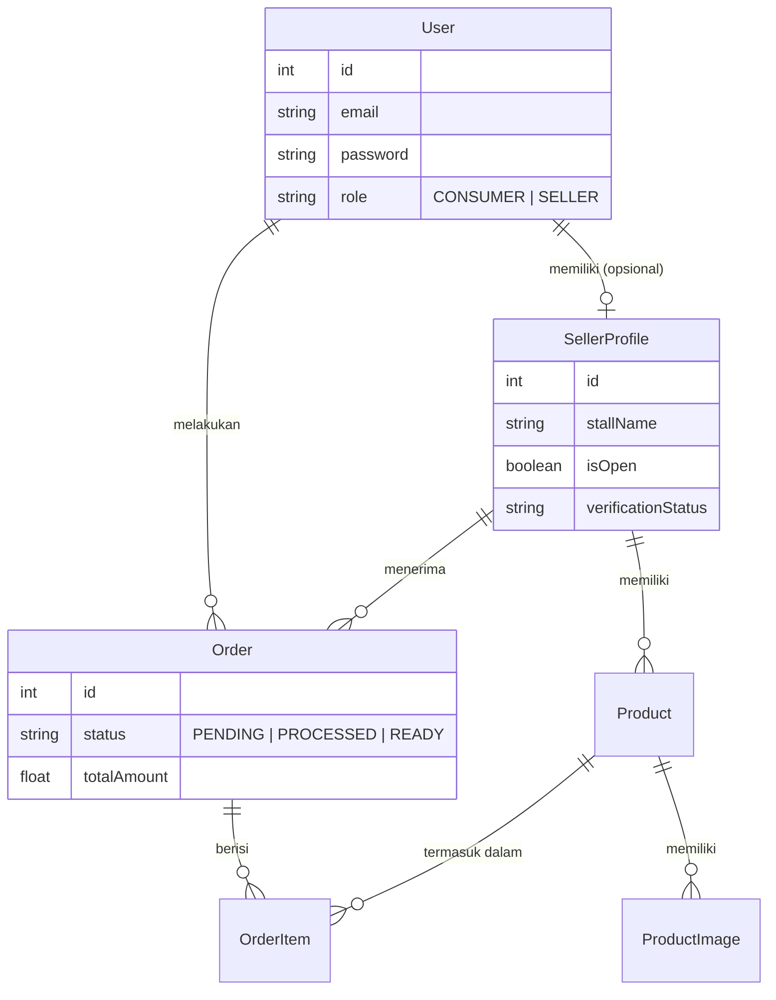

# Laporan Final Project: ITS Hungry Hub

**Pemrograman Framework - 2025/2026**
**Departemen Informatika - Institut Teknologi Sepuluh Nopember**

---

## 1. Identitas Proyek

*   **Nama Proyek**: ITS Hungry Hub
*   **Nama Mahasiswa**: Izzudin Ali Akbari
*   **NRP**: 5025231313
*   **Kategori**: Custom Project (Tingkat Lanjut/Advanced)
    *   *Referensi*: Bagian 4.3 (Food Delivery Platform / Ide Sendiri)
    *   *Justifikasi*: Proyek ini mengimplementasikan ekosistem pesan-antar makanan khusus kampus, yang melibatkan aktor multi-peran (Penjual/Kantin dan Konsumen), status pesanan yang kompleks (Menunggu, Diproses, Siap, Selesai), dan manajemen inventaris waktu nyata (real-time).

---

## 2. Deskripsi Proyek

**ITS Hungry Hub** adalah platform pesan-antar makanan dan pre-order berbasis web yang dirancang khusus untuk lingkungan kampus ITS. Aplikasi ini menjembatani kesenjangan antara kantin kampus (penjual) dan mahasiswa/staf (konsumen).

Berbeda dengan situs E-commerce standar, ITS Hungry Hub berfokus pada:
1.  **Pesanan Kritis Waktu (Time-Critical)**: Optimasi untuk "Pickup" atau "Campus Delivery" dalam waktu istirahat perkuliahan yang singkat.
2.  **Verifikasi Kantin**: Memastikan semua penjual adalah anggota komunitas kampus yang valid.
3.  **Menu Dinamis**: Penjual dapat dengan mudah mengubah ketersediaan kantin (`isOpen`) dan stok secara real-time.

---

## 3. Tech Stack (Teknologi yang Digunakan)

Proyek ini mendemonstrasikan penguasaan pemrograman framework modern sesuai ketentuan:

### Frontend
*   **Framework**: **Next.js 14+** (App Router)
    *   Menggunakan Server Components untuk performa.
    *   Client Components untuk UI interaktif (keranjang belanja, form).
*   **Styling**: Tailwind CSS (CSS modern berbasis utilitas).
*   **Manajemen State**: Zustand (untuk efisiensi state Auth & Keranjang).

### Backend
*   **Framework**: **NestJS** (Arsitektur modular dan terstruktur).
*   **Bahasa**: TypeScript.
*   **Database ORM**: **Prisma** (Akses database yang aman/Type-safe).
*   **Database Engine**: SQLite (Development) / PostgreSQL (Siap Produksi).

### Library Utama Core
*   **Autentikasi**: `@nestjs/jwt`, `passport-jwt`, `bcrypt` (Autentikasi Aman).
*   **Validasi**: `class-validator`, `class-transformer` (Validasi DTO).
*   **Upload File**: `multer` (Penanganan penyimpanan lokal).
*   **Email**: `nodemailer` (Sistem notifikasi).

---

## 4. User Stories & Fitur

Proyek ini mengimplementasikan **7 User Stories Inti**, melebihi persyaratan minimum (6).

### 🔐 Autentikasi & Otorisasi (RBAC)
1.  **Sebagai Pengguna (Penjual/Pembeli)**, saya dapat mendaftar dan login dengan aman.
    *   *Implementasi*: JWT Tokens (Access + Refresh), Hashing Password (Bcrypt).
    *   *Dekorator*: `@Public()`, `@Roles('SELLER')`, `@UseGuards(JwtAuthGuard)`.

### 🏪 Ekosistem Penjual (Kantin)
2.  **Sebagai Penjual**, saya dapat mengelola Profil Kantin saya.
    *   *Implementasi*: Membuat profil, upload KTP untuk verifikasi, mengatur status buka/tutup.
3.  **Sebagai Penjual**, saya dapat mengelola Menu (CRUD Produk).
    *   *Implementasi*: Tambah produk dengan foto (upload), atur stok, harga, dan waktu persiapan.
4.  **Sebagai Penjual**, saya dapat memproses Pesanan masuk.
    *   *Implementasi*: Melihat dashboard pesanan, update status (`Pending` -> `Processing` -> `Ready`).

### 👤 Pengalaman Konsumen (Mahasiswa)
5.  **Sebagai Konsumen**, saya dapat menelusuri dan mencari makanan.
    *   *Implementasi*: Filter berdasarkan kategori, cari berdasarkan nama, lihat ketersediaan kantin.
6.  **Sebagai Konsumen**, saya dapat melakukan Pemesanan (Order).
    *   *Implementasi*: Masukkan ke keranjang, checkout, upload bukti bayar (jika manual) atau transaksi sistem.
7.  **Sebagai Pengguna**, saya dapat melihat Riwayat Pesanan.
    *   *Implementasi*: Melihat pesanan masa lalu dan update status terkini.

---

## 5. Arsitektur Sistem & Database

### Skema Database (Prisma)
Database dirancang untuk menangani integritas data relasional antara Users (Pengguna), SellerProfiles (Profil Penjual), dan Orders (Pesanan).



---

## 6. Strategi Testing

Proyek ini mematuhi persyaratan pengujian yang ketat untuk memastikan keandalan sistem.

### Backend Testing (NestJS)
*   **Unit Testing**: Pengujian terisolasi untuk Services dan Controllers.
*   **E2E Testing**: Pengujian antarmuka alur penuh menggunakan `supertest`.
    *   *Konfigurasi*: `test/jest-e2e.json`.
    *   *Target Coverage*: >70% Statements/Branches.

### Skenario Pengujian yang Diimplementasikan
1.  **Alur Autentikasi**: Register -> Login -> Dapatkan Token.
2.  **Alur Produk**: Buat Produk (Otorisasi Sukses) -> Gagal Buat (Tanpa Izin).
3.  **Alur Pesanan**: Buat Pesanan -> Verifikasi Pengurangan Stok.

---

## 7. Highlight Implementasi (Cuplikan Kode)

*(Anda dapat menyalin cuplikan kode representatif dari folder src Anda di sini, misalnya JwtStrategy atau metode Controller)*

**Contoh: Protected Route (Rute Terlindungi) di NestJS**
```typescript
@UseGuards(JwtAuthGuard, RolesGuard)
@Roles('SELLER')
@Post('products')
create(@Body() createProductDto: CreateProductDto) {
  return this.productsService.create(createProductDto);
}
```

---

## 8. Development & Deployment (Pengembangan & Penerapan)

### Menjalankan Secara Lokal (Running Locally)

**Backend**
```bash
cd backend
pnpm install
npx prisma migrate dev
pnpm start:dev
```

**Frontend**
```bash
cd frontend
pnpm install
pnpm dev
```

**Menjalankan Testing**
```bash
cd backend
pnpm test:cov
pnpm test:e2e
```
